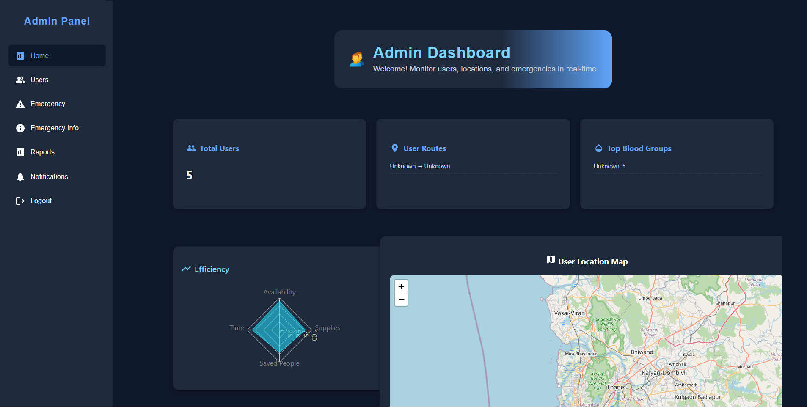
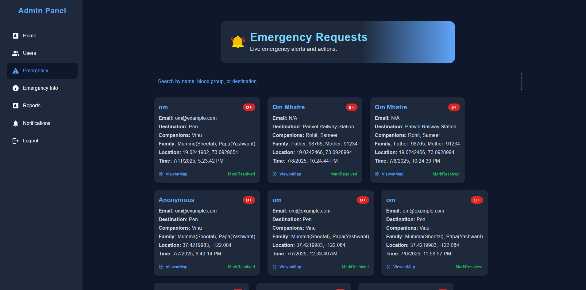
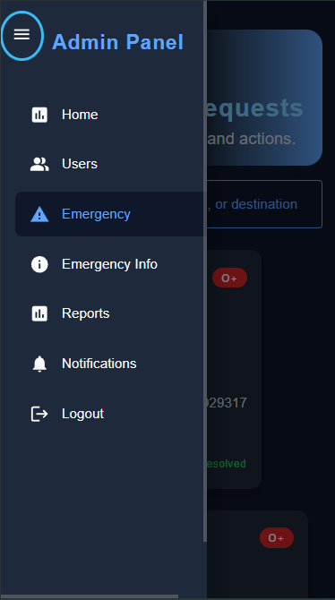
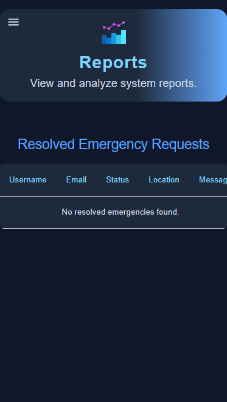

Emergency Admin Dashboard

A professional and modern real-time Admin Dashboard built using React, Vite, and Firebase Realtime Database. This dashboard helps administrators monitor emergency SOS alerts, visualize user statistics, and respond to real-time safety data.

## 🚀 Features

- 📍 Real-time SOS alerts from users
- 🩸 Blood group badges & distribution chart
- 🗺️ Interactive map with user locations
- 📊 Graphs: Efficiency, Call stats (Police, Fire, Rescue)
- 🔍 Search & filter SOS requests
- ✅ Resolve alerts & log history
- 🔐 Firebase Auth (Google Sign-In supported)
- ✨ Clean, modern responsive UI (MUI + Custom CSS)

--------------------------------------------------------
## 🛠️ Tech Stack

| Tech | Usage |
|------|-------|
| ⚛️ React | Frontend library |
| ⚡ Vite | Build tool |
| 🔥 Firebase | Realtime DB + Auth |
| 🧮 Recharts | Data visualizations |
| 🌍 React-Leaflet | Interactive maps |
| 🎨 Material UI | Components and theming |
| 🧪 ESLint | Code linting |

-------------------------------------------------------
## 📁 Folder Structure (basic)

```bash
src/
├── components/
│   └── Header.jsx
├── pages/
│   ├── Home.jsx
│   └── Emergency.jsx
├── firebase.js
├── App.jsx
└── main.jsx
```

### 🚀 Getting Started

1. Clone the repository

git clone https://github.com/your-username/admin-dashboard.git
cd admin-dashboard

2. Install dependencies

npm install

3. Configure Firebase

VITE_FB_API_KEY=your_api_key
VITE_FB_AUTH_DOMAIN=your_auth_domain
VITE_FB_DATABASE_URL=your_rtdb_url
VITE_FB_PROJECT_ID=your_project_id
VITE_FB_STORAGE_BUCKET=your_storage_bucket
VITE_FB_SENDER_ID=your_sender_id
VITE_FB_APP_ID=your_app_id

Note: Never expose your environment variables publicly.

4. Start the development server

npm run dev

🔐 Firebase Security Rules

{
  "rules": {
    "Users": {
      ".read": true,
      "$uid": { ".write": "auth != null && auth.uid === $uid" }
    },
    "users": {
      ".read": true,
      "$uid": { ".write": "auth != null && auth.uid === $uid" }
    },
    "sos_alerts": {
      ".read": true,
      ".write": "auth != null"
    }
  }
}

✍️ Author
Made with ❤️ by Om Mhatre
Feel free to reach out for feedback, collaboration, or contributions.


📸 Screenshots

### 1. Dashboard Overview


### 2. Emergency Alert Cards


### 3. Responsive Admin Navbar


### 3. Responsive Report Page
